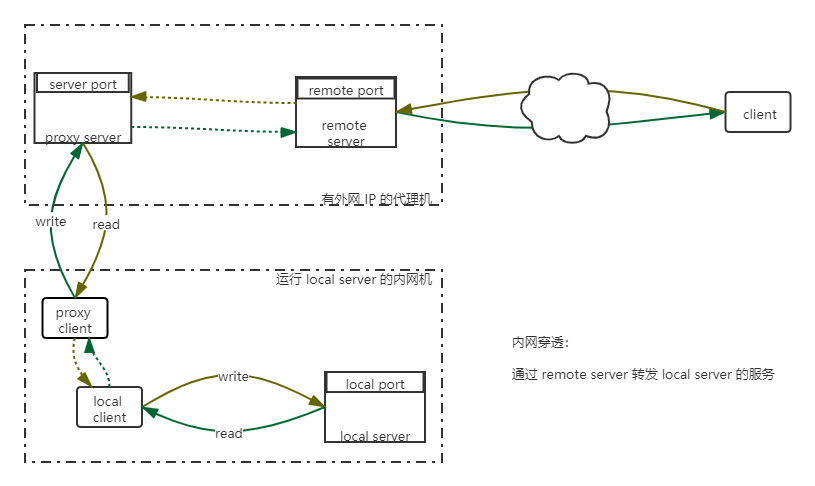

## 内网穿透

将本地服务转发到外网

### 架构

### 配置

`config.js`

* serverAddr：外网代理机 IP 地址
* serverPort：外网代理机端口

* localIp：内网本地服务 IP
* localPort；内网本地服务端口

* remotePort：外网代理机转发端口

### 使用

在代理机运行：

    node server.js

在内网本地机运行：

    node client.js

